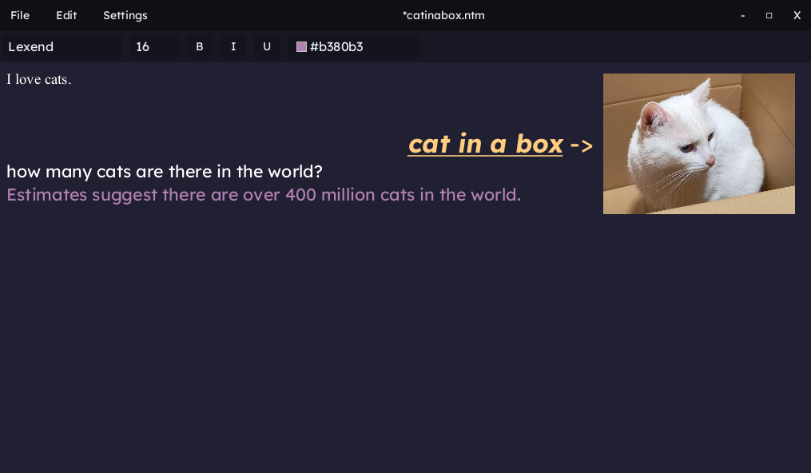

# Notemat
Notemat is a powerful and versatile note-taking application designed to help users create, edit, and manage styled text and images with ease. Whether you're jotting down quick notes, organizing your thoughts, or working on a detailed project, Notemat provides the tools you need to stay productive.

---

## Features
- **Text formatting**: Customize your notes with different fonts, sizes, colours and more.
- **Image support**: Add and manage images directly in your notes.
- **Google Gemini AI Integration**: Leverage Google's Gemini to enhance your notes with suggestions, summarizations and more.
- **Cross-Platform**: Works both on Windows and Linux, with a primary focus on Linux.

---

## Support
Notemat is actively developed and tested on **Linux**, with support for **Windows** as well. While the primary focus is on ensuring a seamless experience on Linux, the application is designed to work reliably on both platforms.

---

## Installing

To run Notemat, you need **Java JDK 21** or later installed on your system. You can download it from the [official Oracle website](https://www.oracle.com/ee/java/technologies/downloads/) or use your system's package manager if you're on Linux.

### Step-by-Step Installation Guide

1. **Clone the Repository**  
   Open a terminal or command prompt and run the following command to clone the Notemat repository:

       git clone https://github.com/importb/notemat

   This will create a local copy of the Notemat source code.

2. **Build the Application**  
   Navigate to the Notemat directory:

       cd notemat

   - For **Linux**:  
     Run the following command to build the application:

         ./gradlew build

   - For **Windows**:  
     Use the following command instead:

         gradlew.bat build

   After the build process completes, the compiled application will be available as a JAR file.

3. **Locate the JAR File**  
   The built JAR file can be found in the following directory:

       /notemat/build/libs/notemat.jar

4. **Run Notemat**  
   Use the following command to run the application:

       java -jar /path/to/notemat.jar

   Replace `/path/to/notemat.jar` with the actual path to the `notemat.jar` file. For example:

       java -jar notemat/build/libs/notemat.jar